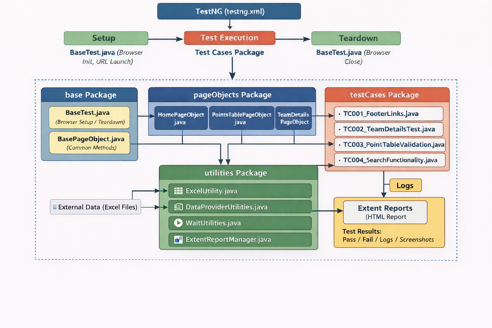
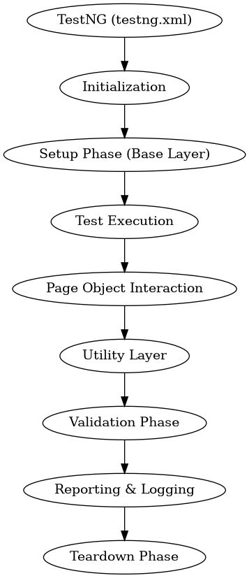

# Precision UI Hybrid Automation Framework

## 📌 Veeva Assignment for Fresh Graduates

---

## 📖 1. Project Overview

**Project Name:** Precision UI Hybrid Automation Framework  

**Assignment:** Veeva Fresh Graduate Assignment – Web Test Automation  

**Team Name:** Phoenix  

**Team Size:** 2  

**Team Members:**  
- Venkateswara Rao Bhimasingi  
- Sai Ganesh Immidisetti  

**Duration:** March 2026 – April 2026  

**Website Under Test:** https://www.iplt20.com  

**GitHub Repository:** https://github.com/Venkateswararaobhimasingi/precision-ui-hybrid-automation-framework

This project is a robust, production-grade **Web Test Automation Framework** designed to validate critical user journeys on the official IPL Website.

Built using **Java and Selenium WebDriver**, the framework follows the **Page Object Model (POM)** design pattern to ensure:

* High maintainability
* Scalability
* Reusability

The framework demonstrates strong capabilities in:

* Data-driven testing
* Cross-browser execution
* Automated reporting

---

## 2. Technical Stack

| Category        | Tools / Technologies         |
| --------------- | ---------------------------- |
| Language        | Java (JDK 17+)               |
| Automation Tool | Selenium WebDriver (v4.40.0) |
| Test Runner     | TestNG (v7.12.0)             |
| Build Tool      | Maven                        |
| Reporting       | Extent Reports (v5.1.2)      |
| Logging         | Log4j2                       |
| Data Management | Apache POI (Excel)           |

---

## 3. Hybrid Framework Architecture & Workflow

### 📁 Project Structure

## 📁 Project Structure

```text
IPLWebTestAutomation/
│
├── src/
│   ├── test/
│   │   ├── java/
│   │   │   ├── base/
│   │   │   │   ├── BasePageObject.java
│   │   │   │   └── BaseTest.java
│   │   │   │
│   │   │   ├── pageObjects/
│   │   │   │   ├── HomePageObject.java
│   │   │   │   ├── PointsTablePageObject.java
│   │   │   │   └── TeamDetailsPageObject.java
│   │   │   │
│   │   │   ├── testCases/
│   │   │   │   ├── TC001_FooterLinks.java
│   │   │   │   ├── TC002_TeamDetailsTest.java
│   │   │   │   ├── TC003_PointTableValidation.java
│   │   │   │   └── TC004_SearchFunctionality.java
│   │   │   │
│   │   │   └── utilities/
│   │   │       ├── DataProviderUtilities.java
│   │   │       ├── ExcelUtility.java
│   │   │       ├── ExtentReportManager.java
│   │   │       └── WaitUtilities.java
│   │   │
│   │   └── resources/
│   │       ├── config.properties
│   │       ├── log4j2.xml
│   │       └── TeamData_IPL_TestCase02.xlsx
│
├── documentation/
│   ├── Architecture_diagram.png
│   ├── workflow_diagram.png
│   └── Precision_UI_Hybrid_Automation_Framework.pdf
├── reports/
├── screenshots/
├── logs/
├── test-output/
├── target/
├── .settings/
├── .git/
└── pom.xml
```

The framework follows a **layered architecture** to ensure clean separation of concerns.

### A. Base Layer (`base` package)

**BaseTest.java**

* Handles WebDriver initialization
* Supports cross-browser setup (Chrome, Edge, Firefox)
* Manages test setup and teardown

**BasePageObject.java**

* Wrapper for Selenium methods
* Provides reusable actions:

  * click()
  * sendKeys()
  * wait handling
* Reduces code duplication

---

### B. Page Object Layer (`pageObjects` package)

Each class represents a web page with:

* Private locators
* Public reusable methods

**HomePageObject**

* Navigation handling
* Footer links validation
* Menu interactions

**PointsTablePageObject**

* Extracts IPL standings data
* Validates ranking and stats

**TeamDetailsPageObject**

* Handles team logos
* Validates trophy-winning years using hover actions

---

### C. Utilities Layer (`utilities` package)

**ExcelUtility & DataProviderUtilities**

* Enable Data-Driven Testing
* Fetch test data from Excel

**WaitUtilities**

* Implements Explicit & Fluent waits
* Handles dynamic elements
* Reduces test flakiness

**ExtentReportManager**

* Generates HTML reports
* Captures screenshots on failure
* Embeds screenshots into reports

---

## 4. Automation Coverage (Test Scenarios)

| ID   | Test Case     | Description                         | Assertion Logic                         |
| ---- | ------------- | ----------------------------------- | --------------------------------------- |
| TC01 | Footer Links  | Validate links in footer sections   | Verify URL / Title after redirection    |
| TC02 | Team Details  | Data-driven validation of team info | Verify logo visibility & years on hover |
| TC03 | Points Table  | Validate Rank 1 team statistics     | Verify matches played & points          |
| TC04 | Search (News) | Validate search for "Auction 2026"  | Verify relevant results displayed       |

---

## 5. Execution Instructions

### ✅ Prerequisites

* Java JDK 17 or higher
* Maven installed and added to system PATH
* Browser drivers configured

---

### ▶️ Run via Maven (Full Suite)

```bash
mvn clean test -DsuiteXmlFile=testng_master.xml
```

---

### ▶️ Run via TestNG XML

Execute specific browser configurations:

* `testng_chrome.xml` → Runs on Chrome
* `testng_edge.xml` → Runs on Edge
* `testng_firefox.xml` → Runs on Firefox

---

## 6. Features & Best Practices

✔ Clean Code

* Follows Java naming conventions
* Uses meaningful method and class names
* Includes JavaDocs

✔ Failure Analysis

* Captures screenshots automatically
* Embeds failures in reports

✔ Modular Design

* UI changes impact only Page Object layer
* Test logic remains unchanged

✔ Robust Execution

* Uses explicit waits
* Handles dynamic web elements efficiently

---

## 7. Deliverables

* 📊 Reports → `/reports`
* 📸 Screenshots → `/screenshots`
* 📝 Logs → `/logs/ipl-automation.log`

---
## 📄 8. Documentation & Diagrams

All project-related documents and diagrams are available in the `documentation/` folder.

### 📘 Project Document
📄 [View Full Documentation](documentation/Precision_UI_Hybrid_Automation_Framework.pdf)

### 🏗️ Architecture Diagram


### 🔄 Workflow Diagram


---

## 🚀 Summary

This project demonstrates the design and development of a **Hybrid Selenium Automation Framework** for end-to-end testing of the IPL website.

The framework combines **Page Object Model (POM)**, **Data-Driven Testing**, and **modular utilities**, making it highly scalable, maintainable, and reusable for real-world applications.

It covers critical user workflows such as navigation, team validation, points table verification, and search functionality, ensuring reliable validation of dynamic web elements.

Built with industry best practices like **cross-browser testing, explicit waits, logging, and automated reporting**, this framework reflects a production-ready automation solution.

Overall, this project showcases strong skills in **automation framework design, UI testing, and test optimization**, making it adaptable for enterprise-level web testing scenarios.
